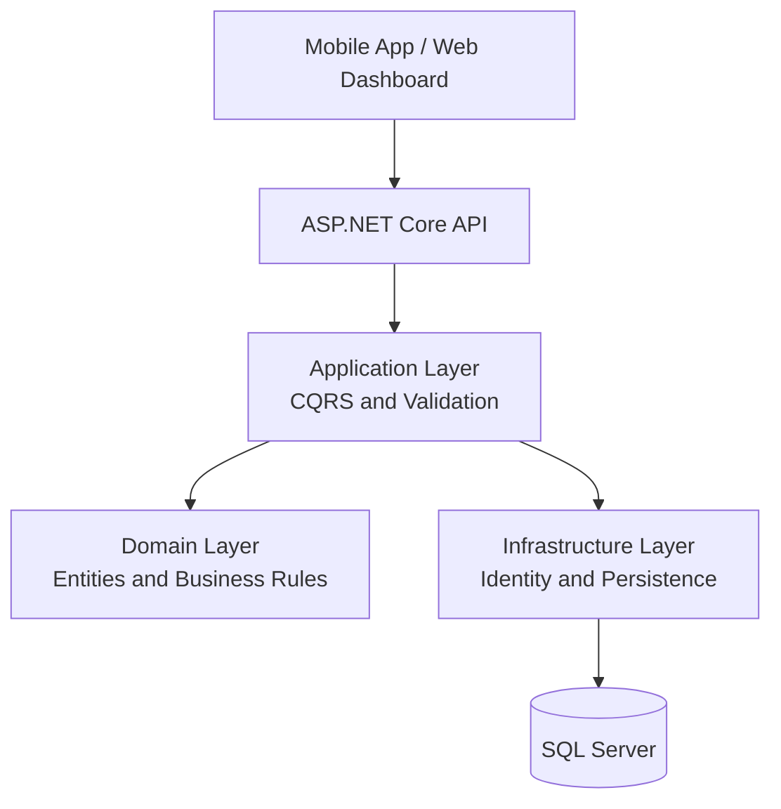

<div align="center">


# EduAdvisor

### Intelligent Academic Advising and Course Registration Platform

*Helping students build valid academic plans while giving advisors and administrators the tools to manage the entire advising workflow.*

<br/>

[](https://dotnet.microsoft.com/)
[](#architecture)
[](#architecture)
[](https://www.microsoft.com/sql-server)

<br/>

**Fayoum University · Faculty of Computers and Artificial Intelligence**
**Graduation Project 2026**

**Under the supervision of Dr. Hebatallah Nabil (د. هبة الله نبيل)**

---

📘 [Live API Documentation](https://eduadvisor.runasp.net/swagger) &nbsp;|&nbsp; 📱 [Mobile App Repository](#) &nbsp;|&nbsp; 💻 [Web Dashboard Repository](#)

</div>

<br/>

## 📑 Table of Contents

- [Overview](#overview)
- [Core Features](#core-features)
- [Technology Stack](#technology-stack)
- [Architecture](#architecture)
- [Project Structure](#project-structure)
- [Getting Started](#getting-started)
- [Configuration](#configuration)
- [API Overview](#api-overview)
- [Security](#security)
- [Supervision](#supervision)
- [Team](#team)

---

## 🎯 Overview

**EduAdvisor** is an academic advising and course registration platform designed for credit-hour programs. It connects students, academic advisors, and university administrators through a unified workflow for managing academic structures, available courses, registration requests, and advisor approvals.

The platform reduces manual registration errors by validating academic data centrally and giving each role access only to the operations required for its responsibilities.

| Challenge | EduAdvisor Solution |
| :--- | :--- |
| Manual course registration and approval | A structured registration-request workflow between students and advisors |
| Inconsistent academic data | Central management of universities, faculties, departments, courses, semesters, and academic plans |
| Limited visibility for advisors | Assigned-student lists and detailed registration-request review |
| Complex access control | JWT authentication with role- and permission-based authorization |
| Difficult system maintenance | Clean Architecture with CQRS-based application use cases |

---

## ✨ Core Features

### 🎓 Student Portal
- Secure student registration, email confirmation, login, and password recovery
- View courses available for registration
- Submit course registration requests
- Track submitted registration requests
- View currently registered courses

### 👨‍🏫 Academic Advisor Portal
- View assigned students
- Review individual registration requests
- Approve or reject pending requests
- Assign students to advisors where the assigned role permits it

### 🛠️ Administration
- Review and approve advisor accounts
- View students, advisors, and pending advisors
- Assign students to academic advisors
- Manage roles, permissions, and user-role assignments

### 📚 Academic Management
- Manage universities, faculties, and departments
- Manage courses and their activation status
- Configure academic plans and course-plan relationships
- Manage semesters and control activation and registration availability
- Assign courses to semesters individually or in bulk

---

## 🧰 Technology Stack

| Area | Technology |
| :--- | :--- |
| Backend | ASP.NET Core 9 Web API |
| Language | C# |
| Persistence | Entity Framework Core 9 |
| Database | Microsoft SQL Server |
| Architecture | Clean Architecture |
| Application Pattern | CQRS with MediatR |
| Authentication | ASP.NET Core Identity and JWT Bearer tokens |
| Validation | FluentValidation through the MediatR pipeline |
| API Documentation | OpenAPI / Swagger |
| Mobile Client | Flutter |
| Web Dashboard | React |

---

## 🏗️ Architecture

The backend follows **Clean Architecture** to keep business rules independent from frameworks and infrastructure concerns. Commands and queries are separated using **CQRS**, with MediatR coordinating application requests.



### Layer Responsibilities

| Layer | Responsibility |
| :--- | :--- |
| Domain | Enterprise entities, enums, value rules, and domain contracts |
| Application | Commands, queries, DTOs, validation, authorization rules, and use cases |
| Infrastructure | EF Core persistence, Identity, JWT services, and external integrations |
| API | HTTP endpoints, middleware, dependency injection, and Swagger configuration |

---

## 📁 Project Structure

```text
EduAdvisor/
├── src/
│   ├── EduAdvisor.Domain/
│   ├── EduAdvisor.Application/
│   ├── EduAdvisor.Infrastructure/
│   └── EduAdvisor.API/
├── tests/
│   ├── EduAdvisor.UnitTests/
│   └── EduAdvisor.IntegrationTests/
├── EduAdvisor.sln
└── README.md
```

> Update this tree if the repository uses different project or test directory names.

---

## 🚀 Getting Started

### Prerequisites

- [.NET 9 SDK](https://dotnet.microsoft.com/download/dotnet/9.0)
- Microsoft SQL Server
- Git

### Run Locally

```bash
git clone <backend-repository-url>
cd EduAdvisor
dotnet restore
dotnet ef database update --project src/EduAdvisor.Infrastructure --startup-project src/EduAdvisor.API
dotnet run --project src/EduAdvisor.API
```

Open Swagger using the URL shown in the application console, typically:

```text
https://localhost:<port>/swagger
```

---

## ⚙️ Configuration

Keep secrets outside committed configuration files. Use .NET User Secrets locally and environment variables in deployed environments.

```bash
dotnet user-secrets init --project src/EduAdvisor.API
dotnet user-secrets set "ConnectionStrings:DefaultConnection" "<sql-server-connection-string>" --project src/EduAdvisor.API
dotnet user-secrets set "Jwt:Key" "<strong-signing-key>" --project src/EduAdvisor.API
```

Typical production settings include:

```text
ConnectionStrings__DefaultConnection
Jwt__Key
Jwt__Issuer
Jwt__Audience
```

---

## 🔌 API Overview

The deployed API documentation is available at [eduadvisor.runasp.net/swagger](https://eduadvisor.runasp.net/swagger).

| Module | Base Route | Main Operations |
| :--- | :--- | :--- |
| Authentication | `/api/Auth` | Login, refresh token, logout, email confirmation, password recovery, student/advisor registration |
| Administration | `/api/v1/Admin` | Advisor approval, user lists, and student assignment |
| Advisors | `/api/v1/Advisors` | Assigned students and registration-request review |
| Students | `/api/v1/Students` | Available courses, registration requests, and registered courses |
| Universities | `/api/v1/Universities` | CRUD and status management |
| Faculties | `/api/v1/Faculties` | CRUD and status management |
| Departments | `/api/Departments` | CRUD and selection lists |
| Courses | `/api/v1/Courses` | CRUD, status management, and selection lists |
| Academic Plans | `/api/v1/CourseAcademicPlans` | Manage courses within academic plans |
| Semesters | `/api/v1/Semesters` | CRUD, activation, and registration controls |
| Semester Courses | `/api/v1/SemesterCourses` | Individual and bulk course assignment |
| Roles | `/api/Roles` | Role management |
| Permissions | `/api/Permissions` | Permission retrieval |
| Users | `/api/Users` | User-role assignment and retrieval |

### Authentication Example

```http
POST /api/Auth/login
Content-Type: application/json

{
  "email": "student@example.com",
  "password": "your-password"
}
```

For protected endpoints, send the access token in the authorization header:

```http
Authorization: Bearer <access-token>
```

---

## 🔐 Security

- JWT Bearer authentication protects secured endpoints
- Refresh tokens support secure session renewal without requiring repeated login
- Role- and permission-based authorization restricts privileged operations
- Password reset uses a verification flow before accepting a new password
- FluentValidation rejects invalid requests before command execution
- Secrets and production connection strings must never be committed to source control

Global exception handling should return a consistent problem-details response without exposing internal stack traces. Application events and failures should be logged through structured logging while excluding passwords, tokens, OTP values, and other sensitive data.

---

## 🎓 Supervision

This graduation project was completed under the supervision of:

**د. هبة الله نبيل — Dr. Hebatallah Nabil**

---

## 👥 Team

<div align="center">

| Member | Role |
| :--- | :--- |
| **Mohammed Khaled** | Team Leader · Backend Developer (.NET) |
| **Mohamed Gamal** | Flutter Developer |
| **Eman Ramadan** | Flutter Developer |
| **Aliaa Mohamed** | UI/UX Designer |
| **Mostafa Ata** | AI Engineer |
| **Ahmed Ragb** |Back End |
| **Mahmoud Waleed** | Front End |

</div>

---

<div align="center">

Built by the **EduAdvisor Graduation Project Team**
Fayoum University · Faculty of Computers and Artificial Intelligence · 2026

</div>
